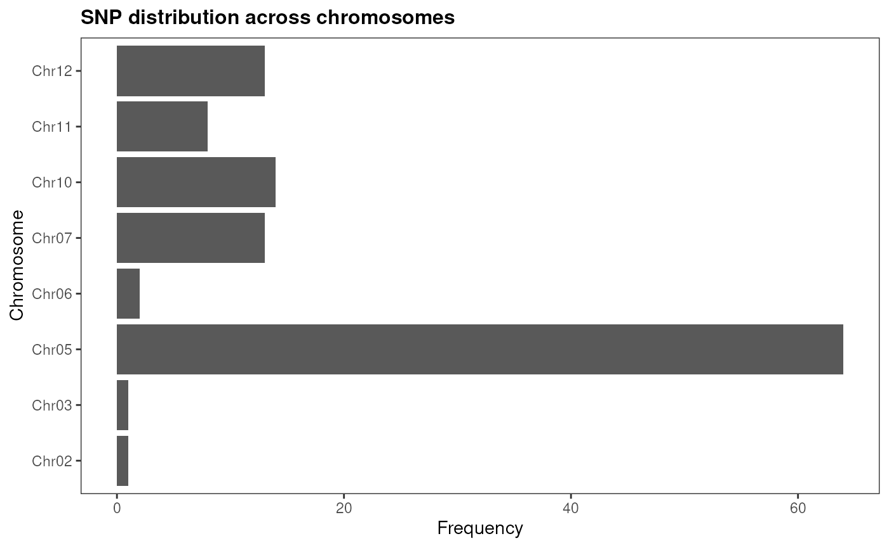
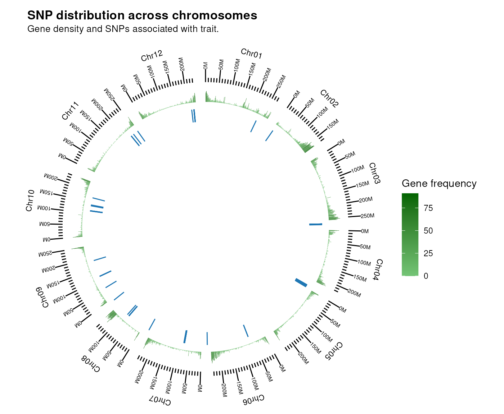
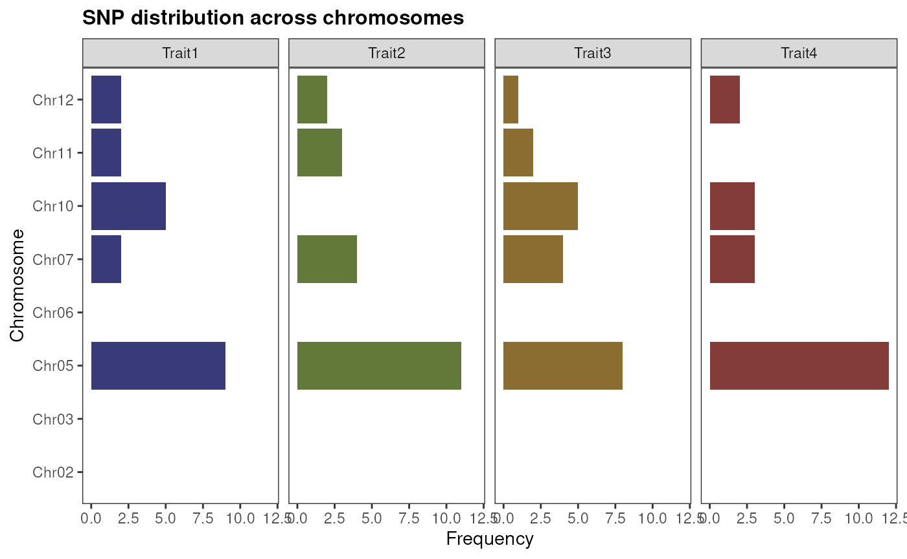
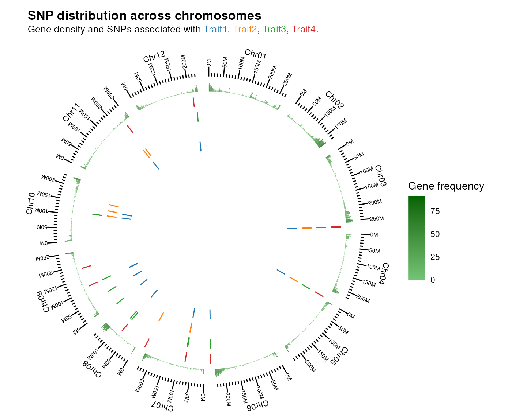
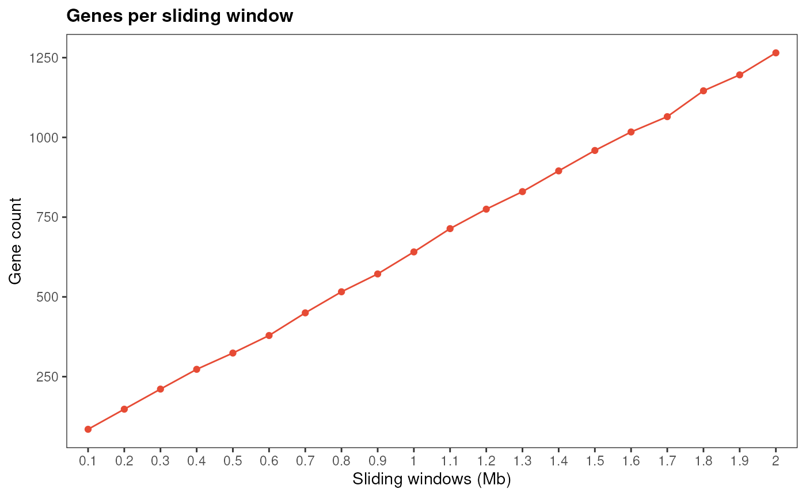
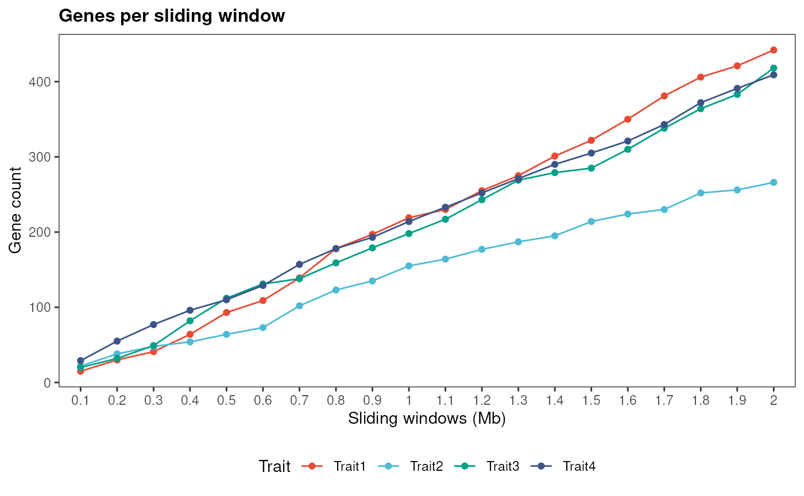

# Mining high-confidence candidate genes with cageminer

## Introduction

Over the past years, RNA-seq data for several species have accumulated
in public repositories. Additionally, genome-wide association studies
(GWAS) have identified SNPs associated with phenotypes of interest, such
as agronomic traits in plants, production traits in livestock, and
complex human diseases. However, although GWAS can identify SNPs, they
cannot identify causative genes associated with the studied phenotype.
The goal of `cageminer` is to integrate GWAS-derived SNPs with
transcriptomic data to mine candidate genes and identify high-confidence
genes associated with traits of interest.

## Citation

If you use `cageminer` in your research, please cite us. You can obtain
citation information with `citation('cageminer')`, as demonstrated
below:

``` r

print(citation('cageminer'), bibtex = TRUE)
#> To cite cageminer in publications use:
#> 
#>   Almeida-Silva, F., & Venancio, T. M. (2022). cageminer: an
#>   R/Bioconductor package to prioritize candidate genes by integrating
#>   genome-wide association studies and gene coexpression networks. in
#>   silico Plants, 4(2), diac018.
#>   https://doi.org/10.1093/insilicoplants/diac018
#> 
#> A BibTeX entry for LaTeX users is
#> 
#>   @Article{,
#>     title = {cageminer: an R/Bioconductor package to prioritize candidate genes by integrating genome-wide association studies and gene coexpression networks},
#>     author = {Fabricio Almeida-Silva and Thiago M. Venancio},
#>     journal = {in silico Plants},
#>     year = {2022},
#>     volume = {4},
#>     number = {2},
#>     pages = {diac018},
#>     url = {https://doi.org/10.1093/insilicoplants/diac018},
#>     doi = {10.1093/insilicoplants/diac018},
#>   }
```

## Installation

``` r

if(!requireNamespace('BiocManager', quietly = TRUE))
  install.packages('BiocManager')
BiocManager::install("cageminer")
```

``` r

# Load package after installation
library(cageminer)
set.seed(123) # for reproducibility
```

## Data description

For this vignette, we will use transcriptomic data on pepper (*Capsicum
annuum*) response to Phytophthora root rot (Kim et al. 2018), and GWAS
SNPs associated with resistance to Phytophthora root rot from Siddique
et al. (2019). To ensure interoperability with other Bioconductor
packages, expression data are stored as SummarizedExperiment objects,
and gene/SNP positions are stored as GRanges objects.

``` r

# GRanges of SNP positions
data(snp_pos)
snp_pos
#> GRanges object with 116 ranges and 0 metadata columns:
#>       seqnames    ranges strand
#>          <Rle> <IRanges>  <Rle>
#>     2    Chr02 149068682      *
#>     3    Chr03   5274098      *
#>     4    Chr05  27703815      *
#>     5    Chr05  27761792      *
#>     6    Chr05  27807397      *
#>   ...      ...       ...    ...
#>   114    Chr12 230514706      *
#>   115    Chr12 230579178      *
#>   116    Chr12 230812962      *
#>   117    Chr12 230887290      *
#>   118    Chr12 231022812      *
#>   -------
#>   seqinfo: 8 sequences from an unspecified genome; no seqlengths

# GRanges of chromosome lengths
data(chr_length) 
chr_length
#> GRanges object with 12 ranges and 0 metadata columns:
#>        seqnames      ranges strand
#>           <Rle>   <IRanges>  <Rle>
#>    [1]    Chr01 1-272704604      *
#>    [2]    Chr02 1-171128871      *
#>    [3]    Chr03 1-257900543      *
#>    [4]    Chr04 1-222584275      *
#>    [5]    Chr05 1-233468049      *
#>    ...      ...         ...    ...
#>    [8]    Chr08 1-145103255      *
#>    [9]    Chr09 1-252779264      *
#>   [10]    Chr10 1-233593809      *
#>   [11]    Chr11 1-259726002      *
#>   [12]    Chr12 1-235688241      *
#>   -------
#>   seqinfo: 12 sequences from an unspecified genome; no seqlengths

# GRanges of gene coordinates
data(gene_ranges) 
gene_ranges
#> GRanges object with 30242 ranges and 6 metadata columns:
#>           seqnames              ranges strand |   source     type     score
#>              <Rle>           <IRanges>  <Rle> | <factor> <factor> <numeric>
#>       [1]    Chr01         63209-63880      - |  PGA1.55     gene        NA
#>       [2]    Chr01       112298-112938      - |  PGA1.55     gene        NA
#>       [3]    Chr01       117979-118392      + |  PGA1.55     gene        NA
#>       [4]    Chr01       119464-119712      + |  PGA1.55     gene        NA
#>       [5]    Chr01       119892-120101      + |  PGA1.55     gene        NA
#>       ...      ...                 ...    ... .      ...      ...       ...
#>   [30238]    Chr12 235631138-235631467      - |  PGA1.55     gene        NA
#>   [30239]    Chr12 235642644-235645110      + |  PGA1.55     gene        NA
#>   [30240]    Chr12 235645483-235651927      - |  PGA1.55     gene        NA
#>   [30241]    Chr12 235652709-235655955      - |  PGA1.55     gene        NA
#>   [30242]    Chr12 235663655-235665276      - |  PGA1.55     gene        NA
#>               phase          ID          Parent
#>           <integer> <character> <CharacterList>
#>       [1]      <NA>  CA01g00010                
#>       [2]      <NA>  CA01g00020                
#>       [3]      <NA>  CA01g00030                
#>       [4]      <NA>  CA01g00040                
#>       [5]      <NA>  CA01g00050                
#>       ...       ...         ...             ...
#>   [30238]      <NA>  CA12g22890                
#>   [30239]      <NA>  CA12g22900                
#>   [30240]      <NA>  CA12g22910                
#>   [30241]      <NA>  CA12g22920                
#>   [30242]      <NA>  CA12g22930                
#>   -------
#>   seqinfo: 12 sequences from an unspecified genome; no seqlengths

# SummarizedExperiment of pepper response to Phytophthora root rot (RNA-seq)
data(pepper_se)
pepper_se
#> class: SummarizedExperiment 
#> dim: 3892 45 
#> metadata(0):
#> assays(1): ''
#> rownames(3892): CA02g23440 CA02g05510 ... CA03g35110 CA02g12750
#> rowData names(0):
#> colnames(45): PL1 PL2 ... TMV-P0-3D TMV-P0-Up
#> colData names(1): Condition
```

## Visualizing SNP distribution

Before mining high-confidence candidates, you can visualize the SNP
distribution in the genome to explore possible patterns. First, let’s
see if SNPs are uniformly across chromosomes with
[`plot_snp_distribution()`](../reference/plot_snp_distribution.md).

``` r

plot_snp_distribution(snp_pos)
```



As we can see, SNPs associated with resistance to Phytophthora root rot
tend to co-occur in chromosome 5. Now, we can see if they are close to
each other in the genome, and if they are located in gene-rich regions.
We can visualize it with `plot_snp_circos`, which displays a circos plot
of SNPs across chromosomes.

``` r

plot_snp_circos(chr_length, gene_ranges, snp_pos)
```



There seems to be no clustering in gene-rich regions, but we can see
that SNPs in the same chromosome tend to be physically close to each
other.

If you have SNP positions for multiple traits, you need to store them in
GRangesList or CompressedGRangesList objects, so each element will have
SNP positions for a particular trait. Then, you can visualize their
distribution as you would do for a single trait. Let’s simulate multiple
traits to see how it works:

``` r

# Simulate multiple traits by sampling 20 SNPs 4 times
snp_list <- GenomicRanges::GRangesList(
  Trait1 = sample(snp_pos, 20),
  Trait2 = sample(snp_pos, 20),
  Trait3 = sample(snp_pos, 20),
  Trait4 = sample(snp_pos, 20)
)

# Visualize SNP distribution across chromosomes
plot_snp_distribution(snp_list)
```



``` r

# Visualize SNP positions in the genome as a circos plot
plot_snp_circos(chr_length, gene_ranges, snp_list)
```



## Algorithm description

The `cageminer` algorithm identifies high-confidence candidate genes
with **3 steps**, which can be interpreted as 3 sources of evidence:

1.  Select all genes in a sliding window relative to each SNP as
    putative candidates.
2.  Find candidates from step 1 in coexpression modules enriched in
    guide genes (genes that are known to be associated with the trait of
    interest).
3.  Find candidates from step 2 that are correlated with a condition of
    interest.

These 3 steps can be executed individually (if users want more control
on what happens after each step) or all at once.

## Step-by-step candidate gene mining

To run the candidate mining step by step, you will need the functions
[`mine_step1()`](../reference/mine_step1.md), `mine_step2`, and
`mine_step3`.

### Step 1: finding genes close to (or in linkage disequilibrium with) SNPs

The function [`mine_step1()`](../reference/mine_step1.md) identifies
genes based on step 1 and returns a GRanges object with all putative
candidates and their location in the genome. For that, you need to give
2 GRanges objects as input, one with the gene coordinates[^1] and
another with the SNP positions.

``` r

candidates1 <- mine_step1(gene_ranges, snp_pos)
candidates1
#> GRanges object with 1265 ranges and 6 metadata columns:
#>          seqnames              ranges strand |   source     type     score
#>             <Rle>           <IRanges>  <Rle> | <factor> <factor> <numeric>
#>      [1]    Chr02 147076830-147083477      + |  PGA1.55     gene        NA
#>      [2]    Chr02 147084450-147086637      - |  PGA1.55     gene        NA
#>      [3]    Chr02 147099482-147104002      - |  PGA1.55     gene        NA
#>      [4]    Chr02 147126373-147126537      + |  PGA1.55     gene        NA
#>      [5]    Chr02 147129897-147132335      - |  PGA1.55     gene        NA
#>      ...      ...                 ...    ... .      ...      ...       ...
#>   [1261]    Chr12 232989761-232990947      - |  PGA1.55     gene        NA
#>   [1262]    Chr12 232994658-232999784      + |  PGA1.55     gene        NA
#>   [1263]    Chr12 233001307-233004705      + |  PGA1.55     gene        NA
#>   [1264]    Chr12 233005539-233011740      - |  PGA1.55     gene        NA
#>   [1265]    Chr12 233018159-233022142      - |  PGA1.55     gene        NA
#>              phase          ID          Parent
#>          <integer> <character> <CharacterList>
#>      [1]      <NA>  CA02g16550                
#>      [2]      <NA>  CA02g16560                
#>      [3]      <NA>  CA02g16570                
#>      [4]      <NA>  CA02g16580                
#>      [5]      <NA>  CA02g16590                
#>      ...       ...         ...             ...
#>   [1261]      <NA>  CA12g21190                
#>   [1262]      <NA>  CA12g21200                
#>   [1263]      <NA>  CA12g21210                
#>   [1264]      <NA>  CA12g21220                
#>   [1265]      <NA>  CA12g21230                
#>   -------
#>   seqinfo: 12 sequences from an unspecified genome; no seqlengths
length(candidates1)
#> [1] 1265
```

The first step identified 1265 putative candidate genes. By default,
`cageminer` uses a sliding window of 2 Mb to select putative
candidates[^2]. If you want to visually inspect a simulation of
different sliding windows to choose a different one, you can use
[`simulate_windows()`](../reference/simulate_windows.md).

``` r

# Single trait
simulate_windows(gene_ranges, snp_pos)
```



``` r


# Multiple traits
simulate_windows(gene_ranges, snp_list)
```



### Step 2: finding coexpression modules enriched in guide genes

The function [`mine_step2()`](../reference/mine_step2.md) selects
candidates in coexpression modules enriched in guide genes. For that,
users must infer the GCN with the function exp2gcn() from the package
BioNERO (Almeida-Silva and Venancio 2021). Guide genes can be either a
character vector of guide gene IDs or a data frame with gene IDs in the
first column and annotation in the second column (useful if guides are
divided in functional categories, for instance). Here, pepper genes
associated with defense-related MapMan bins were retrieved from PLAZA
3.0 Dicots (Proost et al. 2015) and used as guides.

The resulting object is a list of two elements:

- *candidates:* character vector of mined candidate gene IDs.
- *enrichment:* data frame of enrichment results.

``` r

# Load guide genes
data(guides)
head(guides)
#>         Gene                               Description
#> 1 CA10g07770                      response to stimulus
#> 2 CA10g07770                        response to stress
#> 3 CA10g07770             cellular response to stimulus
#> 4 CA10g07770               cellular response to stress
#> 6 CA10g07770 regulation of cellular response to stress
#> 8 CA10g07770        regulation of response to stimulus

# Infer GCN
sft <- BioNERO::SFT_fit(pepper_se, net_type = "signed", cor_method = "pearson")
#> Warning: executing %dopar% sequentially: no parallel backend registered
#>    Power SFT.R.sq   slope truncated.R.sq mean.k. median.k. max.k.
#> 1      3 0.000902  0.0985          0.806   718.0    701.00 1060.0
#> 2      4 0.039500 -0.4680          0.833   470.0    451.00  807.0
#> 3      5 0.110000 -0.6540          0.851   322.0    301.00  639.0
#> 4      6 0.269000 -0.9120          0.891   229.0    209.00  520.0
#> 5      7 0.449000 -1.1200          0.920   168.0    149.00  432.0
#> 6      8 0.598000 -1.2900          0.945   126.0    109.00  364.0
#> 7      9 0.685000 -1.4300          0.949    96.8     81.00  311.0
#> 8     10 0.744000 -1.5000          0.961    75.7     61.30  268.0
#> 9     11 0.786000 -1.5800          0.964    60.2     47.00  233.0
#> 10    12 0.817000 -1.6100          0.969    48.5     36.50  204.0
#> 11    13 0.824000 -1.6600          0.966    39.5     28.80  180.0
#> 12    14 0.831000 -1.6900          0.965    32.5     23.00  159.0
#> 13    15 0.846000 -1.7000          0.972    27.1     18.30  142.0
#> 14    16 0.859000 -1.7100          0.976    22.7     14.70  127.0
#> 15    17 0.869000 -1.7200          0.981    19.2     11.90  115.0
#> 16    18 0.877000 -1.7200          0.984    16.3      9.76  103.0
#> 17    19 0.882000 -1.7200          0.986    14.0      7.97   93.7
#> 18    20 0.889000 -1.7100          0.988    12.0      6.63   85.2
gcn <- BioNERO::exp2gcn(pepper_se, net_type = "signed", cor_method = "pearson",
                        module_merging_threshold = 0.8, SFTpower = sft$power)
#> ..connectivity..
#> ..matrix multiplication (system BLAS)..
#> ..normalization..
#> ..done.

# Apply step 2
candidates2 <- mine_step2(pepper_se, gcn = gcn, guides = guides$Gene,
                          candidates = candidates1$ID)
#> Enrichment analysis for module black...
#> Enrichment analysis for module brown...
#> Enrichment analysis for module darkgreen...
#> Enrichment analysis for module darkgrey...
#> Enrichment analysis for module darkmagenta...
#> Enrichment analysis for module darkolivegreen...
#> Enrichment analysis for module darkorange...
#> Enrichment analysis for module darkorange2...
#> Enrichment analysis for module darkred...
#> Enrichment analysis for module darkturquoise...
#> Enrichment analysis for module green...
#> Enrichment analysis for module grey60...
#> Enrichment analysis for module ivory...
#> Enrichment analysis for module lightcyan...
#> Enrichment analysis for module midnightblue...
#> Enrichment analysis for module orangered4...
#> Enrichment analysis for module paleturquoise...
#> Enrichment analysis for module pink...
#> Enrichment analysis for module red...
#> Enrichment analysis for module royalblue...
#> Enrichment analysis for module salmon...
#> Enrichment analysis for module steelblue...
#> Enrichment analysis for module violet...
candidates2$candidates
#>  [1] "CA10g08490" "CA03g01790" "CA10g12640" "CA12g21230" "CA10g02810"
#>  [6] "CA03g01800" "CA02g17460" "CA10g02800" "CA03g03320" "CA05g14230"
#> [11] "CA07g04010" "CA05g06480" "CA03g02720" "CA10g02630" "CA12g18010"
#> [16] "CA07g04000" "CA02g16570" "CA10g02570" "CA05g15120" "CA02g16830"
#> [21] "CA12g18440" "CA12g18400" "CA10g02780" "CA07g12720" "CA03g01900"
#> [26] "CA12g07460" "CA03g02360" "CA02g16620" "CA10g08420" "CA03g02960"
#> [31] "CA03g03010" "CA05g15110" "CA02g16550" "CA05g14730" "CA02g16900"
#> [36] "CA03g03310" "CA02g17030"
candidates2$enrichment
#>    term genes  all         pval         padj
#> 1 guide   323 1303 2.575418e-05 5.150837e-05
#>                                                                                                                                                                                                                                                                                                                                                                                                                                                                                                                                                                                                                                                                                                                                                                                                                                                                                                                                                                                                                                                                                                                                                                                                                                                                                                                                                                                                                                                                                                                                                                                                                                                                                                                                                                                                                                                                                                                                                                                                                                                                                                                                                                                                                                                                                                                                                                                                                                                                                                                                                                                                                                                                                                                                                                                                                                                                                                                                                                                                                                                                                                                                                                                                                                                                                                                                                                                                                                                                                                                                                                                                                                                                                            gene_id
#> 1 CA01g00320/CA01g00480/CA01g00740/CA01g01120/CA01g01470/CA01g03330/CA01g03580/CA01g05790/CA01g06190/CA01g07040/CA01g09730/CA01g10140/CA01g11400/CA01g12830/CA01g12840/CA01g15970/CA01g18200/CA01g19830/CA01g25570/CA01g25740/CA01g26380/CA01g27330/CA01g27360/CA01g27650/CA01g28500/CA01g30510/CA01g31330/CA01g34470/CA02g00280/CA02g00310/CA02g00560/CA02g00910/CA02g01560/CA02g03350/CA02g04110/CA02g06320/CA02g07440/CA02g09140/CA02g09790/CA02g11350/CA02g13810/CA02g14640/CA02g14910/CA02g15330/CA02g15540/CA02g15860/CA02g16550/CA02g17460/CA02g18810/CA02g19190/CA02g19740/CA02g20130/CA02g20570/CA02g21070/CA02g22080/CA02g23440/CA02g23570/CA02g24110/CA02g24270/CA02g24340/CA02g25080/CA02g25100/CA02g25180/CA02g25570/CA02g28850/CA02g29330/CA02g29530/CA02g29590/CA03g01500/CA03g01790/CA03g01900/CA03g03310/CA03g03320/CA03g03750/CA03g04210/CA03g04230/CA03g05850/CA03g05910/CA03g06690/CA03g07210/CA03g07300/CA03g07750/CA03g07870/CA03g08860/CA03g09290/CA03g10040/CA03g10360/CA03g15850/CA03g15860/CA03g17560/CA03g19350/CA03g19580/CA03g20380/CA03g22730/CA03g22790/CA03g23510/CA03g23630/CA03g28400/CA03g28670/CA03g29180/CA03g29760/CA03g30020/CA03g30250/CA03g30650/CA03g30690/CA03g31030/CA03g31190/CA03g32600/CA03g33190/CA03g34100/CA03g34590/CA03g35130/CA03g35140/CA03g35590/CA03g35890/CA03g36980/CA04g00240/CA04g00730/CA04g03470/CA04g04090/CA04g05900/CA04g05970/CA04g07310/CA04g07760/CA04g08090/CA04g08220/CA04g08650/CA04g09320/CA04g11150/CA04g11250/CA04g14010/CA04g14020/CA04g14160/CA04g16180/CA04g16450/CA04g17220/CA04g17860/CA04g17920/CA04g19080/CA04g19680/CA04g20890/CA04g23480/CA05g03260/CA05g03360/CA05g03470/CA05g04410/CA05g04830/CA05g05240/CA05g06480/CA05g07240/CA05g07870/CA05g12470/CA05g13460/CA05g14230/CA05g14730/CA05g16560/CA05g17560/CA05g18750/CA05g20780/CA05g20790/CA06g00050/CA06g00060/CA06g00470/CA06g00480/CA06g02280/CA06g03050/CA06g06240/CA06g06260/CA06g06270/CA06g06990/CA06g09410/CA06g10200/CA06g11310/CA06g14270/CA06g14290/CA06g15240/CA06g17350/CA06g17500/CA06g17520/CA06g18860/CA06g19250/CA06g19490/CA06g20530/CA06g21320/CA06g22410/CA06g25350/CA06g25930/CA06g25940/CA06g26650/CA06g28010/CA07g00490/CA07g04410/CA07g04890/CA07g05830/CA07g06700/CA07g06720/CA07g07840/CA07g08630/CA07g11190/CA07g11250/CA07g12720/CA07g13050/CA07g13240/CA07g14400/CA07g14430/CA07g14630/CA07g16060/CA07g16510/CA07g17050/CA07g19020/CA07g19710/CA07g20230/CA07g20250/CA07g20800/CA08g00690/CA08g02960/CA08g04480/CA08g06250/CA08g06530/CA08g06650/CA08g08240/CA08g09820/CA08g10190/CA08g10220/CA08g10230/CA08g10860/CA08g10920/CA08g11610/CA08g11620/CA08g11900/CA08g11980/CA08g12160/CA08g12450/CA08g12660/CA08g13240/CA08g13340/CA08g13350/CA08g13510/CA08g14480/CA08g15500/CA08g15610/CA08g15620/CA08g15740/CA08g15900/CA08g16410/CA08g17710/CA08g18790/CA08g19220/CA08g19480/CA09g01030/CA09g02170/CA09g02410/CA09g02420/CA09g02430/CA09g03530/CA09g04530/CA09g05970/CA09g08100/CA09g14690/CA09g17240/CA09g18730/CA10g04080/CA10g04720/CA10g06450/CA10g08490/CA10g08530/CA10g09720/CA10g10440/CA10g10590/CA10g10660/CA10g11170/CA10g11770/CA10g12380/CA10g14090/CA10g14270/CA10g14530/CA10g14540/CA10g14560/CA10g14760/CA10g16030/CA10g17530/CA10g17910/CA10g18580/CA10g19040/CA10g19490/CA10g20200/CA10g20510/CA10g21570/CA10g21770/CA10g22350/CA11g00060/CA11g00180/CA11g00430/CA11g00650/CA11g02330/CA11g04780/CA11g07880/CA11g07920/CA11g07980/CA11g09720/CA11g10980/CA11g17670/CA11g19120/CA11g19600/CA12g00120/CA12g00940/CA12g03110/CA12g04970/CA12g07010/CA12g09850/CA12g10090/CA12g10170/CA12g10200/CA12g10670/CA12g14680/CA12g15570/CA12g16290/CA12g18010/CA12g18900/CA12g19270/CA12g21600/CA12g22660/CA12g22930
#>   category module
#> 1    Class  black
```

After the step 2, we got 37 candidates.

### Step 3: finding genes with altered expression in a condition of interest

The function [`mine_step3()`](../reference/mine_step3.md) identifies
candidate genes whose expression levels significantly increase or
decrease in a particular condition. For that, you need to specify what
level from the sample metadata corresponds to this condition. The
resulting object from [`mine_step3()`](../reference/mine_step3.md) is a
data frame with mined candidates and their correlation to the condition
of interest.

``` r

# See the levels from the sample metadata
unique(pepper_se$Condition)
#> [1] "Placenta"      "Pericarp"      "PRR_control"   "PRR_stress"   
#> [5] "virus_control" "PepMov_stress" "TMV"

# Apply step 3 using "PRR_stress" as the condition of interest
candidates3 <- mine_step3(pepper_se, candidates = candidates2$candidates,
                          sample_group = "PRR_stress")
candidates3
#>           gene      trait       cor       pvalue     group
#> 159 CA07g04010 PRR_stress 0.6441044 1.806861e-06 Condition
#> 152 CA07g04000 PRR_stress 0.6304891 3.453184e-06 Condition
#> 54  CA03g01790 PRR_stress 0.6270820 4.041221e-06 Condition
#> 194 CA10g02800 PRR_stress 0.5944358 1.666104e-05 Condition
#> 26  CA02g16830 PRR_stress 0.5896431 2.025006e-05 Condition
#> 257 CA12g21230 PRR_stress 0.5820251 2.743821e-05 Condition
#> 82  CA03g02720 PRR_stress 0.5817119 2.777850e-05 Condition
#> 131 CA05g14730 PRR_stress 0.5660078 5.072546e-05 Condition
#> 33  CA02g16900 PRR_stress 0.5633723 5.595313e-05 Condition
#> 236 CA12g18010 PRR_stress 0.5532646 8.088901e-05 Condition
#> 103 CA03g03310 PRR_stress 0.5520272 8.455364e-05 Condition
#> 19  CA02g16620 PRR_stress 0.5426992 1.174310e-04 Condition
#> 47  CA02g17460 PRR_stress 0.5415951 1.220086e-04 Condition
#> 201 CA10g02810 PRR_stress 0.5368391 1.436389e-04 Condition
#> 173 CA10g02570 PRR_stress 0.5363652 1.459748e-04 Condition
#> 61  CA03g01800 PRR_stress 0.5317864 1.703832e-04 Condition
#> 187 CA10g02780 PRR_stress 0.5255675 2.094609e-04 Condition
#> 250 CA12g18440 PRR_stress 0.5135431 3.087865e-04 Condition
#> 5   CA02g16550 PRR_stress 0.5099801 3.454712e-04 Condition
#> 75  CA03g02360 PRR_stress 0.4245213 3.655030e-03 Condition
#> 89  CA03g02960 PRR_stress 0.4132336 4.782097e-03 Condition
#> 208 CA10g08420 PRR_stress 0.4123162 4.885782e-03 Condition
#> 96  CA03g03010 PRR_stress 0.4074773 5.465748e-03 Condition
#> 215 CA10g08490 PRR_stress 0.3866456 8.700127e-03 Condition
#> 166 CA07g12720 PRR_stress 0.3829689 9.416098e-03 Condition
#> 145 CA05g15120 PRR_stress 0.3701199 1.233022e-02 Condition
#> 222 CA10g12640 PRR_stress 0.3264978 2.859993e-02 Condition
#> 12  CA02g16570 PRR_stress 0.3207866 3.167524e-02 Condition
#> 229 CA12g07460 PRR_stress 0.3076388 3.980351e-02 Condition
#> 110 CA03g03320 PRR_stress 0.3045042 4.197434e-02 Condition
```

Finally, we got 30 high-confidence candidate genes associated with
resistance to Phytophthora root rot. Genes with negative correlation
coefficients to the condition can be interpreted as having significantly
reduced expression in this condition, while genes with positive
correlation coefficients have significantly increased expression in this
condition.

## Automatic candidate gene mining

Alternatively, if you are not interested in inspecting the results after
each step, you can get to the same results from the previous section
with a single step by using the function
[`mine_candidates()`](../reference/mine_candidates.md). This function is
a wrapper that calls [`mine_step1()`](../reference/mine_step1.md), sends
the results to [`mine_step2()`](../reference/mine_step2.md), and then it
sends the results from [`mine_step2()`](../reference/mine_step2.md) to
[`mine_step3()`](../reference/mine_step3.md).

``` r

candidates <- mine_candidates(gene_ranges = gene_ranges, 
                              marker_ranges = snp_pos, 
                              exp = pepper_se,
                              gcn = gcn, guides = guides$Gene,
                              sample_group = "PRR_stress")
#> Enrichment analysis for module black...
#> Enrichment analysis for module brown...
#> Enrichment analysis for module darkgreen...
#> Enrichment analysis for module darkgrey...
#> Enrichment analysis for module darkmagenta...
#> Enrichment analysis for module darkolivegreen...
#> Enrichment analysis for module darkorange...
#> Enrichment analysis for module darkorange2...
#> Enrichment analysis for module darkred...
#> Enrichment analysis for module darkturquoise...
#> Enrichment analysis for module green...
#> Enrichment analysis for module grey60...
#> Enrichment analysis for module ivory...
#> Enrichment analysis for module lightcyan...
#> Enrichment analysis for module midnightblue...
#> Enrichment analysis for module orangered4...
#> Enrichment analysis for module paleturquoise...
#> Enrichment analysis for module pink...
#> Enrichment analysis for module red...
#> Enrichment analysis for module royalblue...
#> Enrichment analysis for module salmon...
#> Enrichment analysis for module steelblue...
#> Enrichment analysis for module violet...
candidates
#>           gene      trait       cor       pvalue     group
#> 159 CA07g04010 PRR_stress 0.6441044 1.806861e-06 Condition
#> 152 CA07g04000 PRR_stress 0.6304891 3.453184e-06 Condition
#> 54  CA03g01790 PRR_stress 0.6270820 4.041221e-06 Condition
#> 194 CA10g02800 PRR_stress 0.5944358 1.666104e-05 Condition
#> 26  CA02g16830 PRR_stress 0.5896431 2.025006e-05 Condition
#> 257 CA12g21230 PRR_stress 0.5820251 2.743821e-05 Condition
#> 82  CA03g02720 PRR_stress 0.5817119 2.777850e-05 Condition
#> 131 CA05g14730 PRR_stress 0.5660078 5.072546e-05 Condition
#> 33  CA02g16900 PRR_stress 0.5633723 5.595313e-05 Condition
#> 236 CA12g18010 PRR_stress 0.5532646 8.088901e-05 Condition
#> 103 CA03g03310 PRR_stress 0.5520272 8.455364e-05 Condition
#> 19  CA02g16620 PRR_stress 0.5426992 1.174310e-04 Condition
#> 47  CA02g17460 PRR_stress 0.5415951 1.220086e-04 Condition
#> 201 CA10g02810 PRR_stress 0.5368391 1.436389e-04 Condition
#> 173 CA10g02570 PRR_stress 0.5363652 1.459748e-04 Condition
#> 61  CA03g01800 PRR_stress 0.5317864 1.703832e-04 Condition
#> 187 CA10g02780 PRR_stress 0.5255675 2.094609e-04 Condition
#> 250 CA12g18440 PRR_stress 0.5135431 3.087865e-04 Condition
#> 5   CA02g16550 PRR_stress 0.5099801 3.454712e-04 Condition
#> 75  CA03g02360 PRR_stress 0.4245213 3.655030e-03 Condition
#> 89  CA03g02960 PRR_stress 0.4132336 4.782097e-03 Condition
#> 208 CA10g08420 PRR_stress 0.4123162 4.885782e-03 Condition
#> 96  CA03g03010 PRR_stress 0.4074773 5.465748e-03 Condition
#> 215 CA10g08490 PRR_stress 0.3866456 8.700127e-03 Condition
#> 166 CA07g12720 PRR_stress 0.3829689 9.416098e-03 Condition
#> 145 CA05g15120 PRR_stress 0.3701199 1.233022e-02 Condition
#> 222 CA10g12640 PRR_stress 0.3264978 2.859993e-02 Condition
#> 12  CA02g16570 PRR_stress 0.3207866 3.167524e-02 Condition
#> 229 CA12g07460 PRR_stress 0.3076388 3.980351e-02 Condition
#> 110 CA03g03320 PRR_stress 0.3045042 4.197434e-02 Condition
```

## Score candidates

In some cases, you might have more high-confidence candidates than you
expected, and you want to pick only the top *n* genes for validation,
for instance. In this scenario, you need to assign scores to your mined
candidates to pick the top *n* genes with the highest scores. The
function [`score_genes()`](../reference/score_genes.md) does that by
using the formula below:

``` math
S_i = r_{pb} \kappa
```

where:

$`\kappa`$ = 2 if the gene encodes a transcription factor

$`\kappa`$ = 2 if the gene is a hub

$`\kappa`$ = 3 if the gene encodes a hub transcription factor

$`\kappa`$ = 1 if none of the conditions above are true

By default, `score_genes` picks the top 10 candidates. If there are less
than 10 candidates, it will return all candidates sorted by scores.
Here, TFs were obtained from PlantTFDB 4.0 (Jin et al. 2017). Hub genes
can be identified with the function `get_hubs_gcn()` from the package
BioNERO.

``` r

# Load TFs
data(tfs)
head(tfs)
#>      Gene_ID Family
#> 1 CA12g20650    RAV
#> 2 CA00g00130   WRKY
#> 3 CA00g00230   WRKY
#> 4 CA00g00390    LBD
#> 5 CA00g03050    NAC
#> 6 CA00g07140 E2F/DP

# Get GCN hubs
hubs <- BioNERO::get_hubs_gcn(pepper_se, gcn)
head(hubs)
#>         Gene Module  kWithin
#> 1 CA12g18900  black 161.1001
#> 2 CA07g15040  black 159.9350
#> 3 CA07g15050  black 157.9800
#> 4 CA05g00150  black 153.9266
#> 5 CA03g08130  black 152.7083
#> 6 CA10g03980  black 148.5663

# Score candidates
scored <- score_genes(candidates, hubs$Gene, tfs$Gene_ID)
scored
#>           gene      trait       cor       pvalue     group     score
#> 194 CA10g02800 PRR_stress 0.5944358 1.666104e-05 Condition 1.1888715
#> 26  CA02g16830 PRR_stress 0.5896431 2.025006e-05 Condition 1.1792862
#> 47  CA02g17460 PRR_stress 0.5415951 1.220086e-04 Condition 1.0831901
#> 61  CA03g01800 PRR_stress 0.5317864 1.703832e-04 Condition 1.0635728
#> 75  CA03g02360 PRR_stress 0.4245213 3.655030e-03 Condition 0.8490427
#> 159 CA07g04010 PRR_stress 0.6441044 1.806861e-06 Condition 0.6441044
#> 152 CA07g04000 PRR_stress 0.6304891 3.453184e-06 Condition 0.6304891
#> 54  CA03g01790 PRR_stress 0.6270820 4.041221e-06 Condition 0.6270820
#> 257 CA12g21230 PRR_stress 0.5820251 2.743821e-05 Condition 0.5820251
#> 82  CA03g02720 PRR_stress 0.5817119 2.777850e-05 Condition 0.5817119
```

As none of the mined candidates are hubs or encode transcription
factors, their scores are simply their correlation coefficients with the
condition of interest.

## Session information

This document was created under the following conditions:

``` r

sessioninfo::session_info()
#> ─ Session info ───────────────────────────────────────────────────────────────
#>  setting  value
#>  version  R version 4.6.1 (2026-06-24)
#>  os       Ubuntu 24.04.4 LTS
#>  system   x86_64, linux-gnu
#>  ui       X11
#>  language en
#>  collate  en_US.UTF-8
#>  ctype    en_US.UTF-8
#>  tz       UTC
#>  date     2026-07-09
#>  pandoc   3.10 @ /usr/bin/ (via rmarkdown)
#>  quarto   1.9.38 @ /usr/local/bin/quarto
#> 
#> ─ Packages ───────────────────────────────────────────────────────────────────
#>  package              * version   date (UTC) lib source
#>  abind                  1.4-8     2024-09-12 [1] RSPM (R 4.6.0)
#>  annotate               1.91.0    2026-04-28 [1] Bioconductor 3.24 (R 4.6.0)
#>  AnnotationDbi          1.75.0    2026-04-28 [1] Bioconductor 3.24 (R 4.6.0)
#>  AnnotationFilter       1.37.0    2026-04-28 [1] Bioconductor 3.24 (R 4.6.0)
#>  backports              1.5.1     2026-04-03 [1] RSPM (R 4.6.0)
#>  base64enc              0.1-6     2026-02-02 [2] RSPM (R 4.6.0)
#>  Biobase                2.73.1    2026-04-29 [1] Bioconductor 3.24 (R 4.6.0)
#>  BiocBaseUtils          1.15.1    2026-05-10 [1] Bioconductor 3.24 (R 4.6.0)
#>  BiocGenerics           0.59.10   2026-07-07 [1] Bioconductor 3.24 (R 4.6.1)
#>  BiocIO                 1.23.3    2026-04-29 [1] Bioconductor 3.24 (R 4.6.0)
#>  BiocManager            1.30.27   2025-11-14 [1] RSPM (R 4.6.0)
#>  BiocParallel           1.47.0    2026-04-28 [1] Bioconductor 3.24 (R 4.6.0)
#>  BiocStyle            * 2.41.0    2026-04-28 [1] Bioconductor 3.24 (R 4.6.0)
#>  BioNERO                1.21.0    2026-04-28 [1] Bioconductor 3.24 (R 4.6.0)
#>  Biostrings             2.81.5    2026-07-05 [1] Bioconductor 3.24 (R 4.6.1)
#>  biovizBase             1.61.0    2026-04-28 [1] Bioconductor 3.24 (R 4.6.0)
#>  bit                    4.6.0     2025-03-06 [1] RSPM (R 4.6.0)
#>  bit64                  4.8.2     2026-05-19 [1] RSPM (R 4.6.0)
#>  bitops                 1.0-9     2024-10-03 [1] RSPM (R 4.6.0)
#>  blob                   1.3.0     2026-01-14 [1] RSPM (R 4.6.0)
#>  bookdown               0.47      2026-06-16 [1] RSPM (R 4.6.0)
#>  BSgenome               1.81.0    2026-04-28 [1] Bioconductor 3.24 (R 4.6.0)
#>  bslib                  0.11.0    2026-05-16 [2] RSPM (R 4.6.0)
#>  cachem                 1.1.0     2024-05-16 [2] RSPM (R 4.6.0)
#>  cageminer            * 1.19.0    2026-07-09 [1] Bioconductor
#>  checkmate              2.3.4     2026-02-03 [1] RSPM (R 4.6.0)
#>  cigarillo              1.3.0     2026-04-28 [1] Bioconductor 3.24 (R 4.6.0)
#>  circlize               0.4.18    2026-04-04 [1] RSPM (R 4.6.0)
#>  cli                    3.6.6     2026-04-09 [2] RSPM (R 4.6.0)
#>  clue                   0.3-68    2026-03-26 [1] RSPM (R 4.6.0)
#>  cluster                2.1.8.2   2026-02-05 [3] CRAN (R 4.6.1)
#>  coda                   0.19-4.1  2024-01-31 [1] RSPM (R 4.6.0)
#>  codetools              0.2-20    2024-03-31 [3] CRAN (R 4.6.1)
#>  colorspace             2.1-2     2025-09-22 [1] RSPM (R 4.6.0)
#>  commonmark             2.0.0     2025-07-07 [2] RSPM (R 4.6.0)
#>  ComplexHeatmap         2.29.0    2026-04-28 [1] Bioconductor 3.24 (R 4.6.0)
#>  crayon                 1.5.3     2024-06-20 [2] RSPM (R 4.6.0)
#>  curl                   7.1.0     2026-04-22 [2] RSPM (R 4.6.0)
#>  data.table             1.18.4    2026-05-06 [1] RSPM (R 4.6.0)
#>  DBI                    1.3.0     2026-02-25 [1] RSPM (R 4.6.0)
#>  DelayedArray           0.39.3    2026-06-01 [1] Bioconductor 3.24 (R 4.6.0)
#>  desc                   1.4.3     2023-12-10 [2] RSPM (R 4.6.0)
#>  dichromat              2.0-0.1   2022-05-02 [1] RSPM (R 4.6.0)
#>  digest                 0.6.39    2025-11-19 [2] RSPM (R 4.6.0)
#>  doParallel             1.0.17    2022-02-07 [1] RSPM (R 4.6.0)
#>  dplyr                  1.2.1     2026-04-03 [1] RSPM (R 4.6.0)
#>  dynamicTreeCut         1.63-1    2016-03-11 [1] RSPM (R 4.6.0)
#>  edgeR                  4.11.4    2026-06-28 [1] Bioconductor 3.24 (R 4.6.1)
#>  ensembldb              2.37.3    2026-06-07 [1] Bioconductor 3.24 (R 4.6.0)
#>  evaluate               1.0.5     2025-08-27 [2] RSPM (R 4.6.0)
#>  farver                 2.1.2     2024-05-13 [1] RSPM (R 4.6.0)
#>  fastcluster            1.3.0     2025-05-07 [1] RSPM (R 4.6.0)
#>  fastmap                1.2.0     2024-05-15 [2] RSPM (R 4.6.0)
#>  foreach                1.5.2     2022-02-02 [1] RSPM (R 4.6.0)
#>  foreign                0.8-91    2026-01-29 [3] CRAN (R 4.6.1)
#>  Formula                1.2-5     2023-02-24 [1] RSPM (R 4.6.0)
#>  fs                     2.1.0     2026-04-18 [2] RSPM (R 4.6.0)
#>  genefilter             1.95.0    2026-04-28 [1] Bioconductor 3.24 (R 4.6.0)
#>  generics               0.1.4     2025-05-09 [1] RSPM (R 4.6.0)
#>  GENIE3                 1.35.0    2026-04-28 [1] Bioconductor 3.24 (R 4.6.0)
#>  GenomeInfoDb           1.49.1    2026-05-24 [1] Bioconductor 3.24 (R 4.6.0)
#>  GenomicAlignments      1.49.0    2026-04-28 [1] Bioconductor 3.24 (R 4.6.0)
#>  GenomicFeatures        1.65.0    2026-04-28 [1] Bioconductor 3.24 (R 4.6.0)
#>  GenomicRanges          1.65.0    2026-04-28 [1] Bioconductor 3.24 (R 4.6.0)
#>  GetoptLong             1.1.1     2026-04-08 [1] RSPM (R 4.6.0)
#>  ggbio                  1.61.0    2026-04-28 [1] Bioconductor 3.24 (R 4.6.0)
#>  ggdendro               0.2.0     2024-02-23 [1] RSPM (R 4.6.0)
#>  ggnetwork              0.5.14    2025-09-10 [1] RSPM (R 4.6.0)
#>  ggplot2                4.0.3     2026-04-22 [1] RSPM (R 4.6.0)
#>  ggrepel                0.9.8     2026-03-17 [1] RSPM (R 4.6.0)
#>  ggtext                 0.1.2     2022-09-16 [1] RSPM (R 4.6.0)
#>  GlobalOptions          0.1.4     2026-04-08 [1] RSPM (R 4.6.0)
#>  glue                   1.8.1     2026-04-17 [2] RSPM (R 4.6.0)
#>  graph                  1.91.0    2026-04-28 [1] Bioconductor 3.24 (R 4.6.0)
#>  gridExtra              2.3.1     2026-06-25 [1] RSPM (R 4.6.0)
#>  gridtext               0.1.6     2026-02-19 [1] RSPM (R 4.6.0)
#>  gtable                 0.3.6     2024-10-25 [1] RSPM (R 4.6.0)
#>  Hmisc                  5.2-6     2026-06-19 [1] RSPM (R 4.6.0)
#>  htmlTable              2.5.0     2026-04-22 [1] RSPM (R 4.6.0)
#>  htmltools              0.5.9     2025-12-04 [2] RSPM (R 4.6.0)
#>  htmlwidgets            1.6.4     2023-12-06 [2] RSPM (R 4.6.0)
#>  httr                   1.4.8     2026-02-13 [1] RSPM (R 4.6.0)
#>  igraph                 2.3.3     2026-06-26 [1] RSPM (R 4.6.0)
#>  impute                 1.87.0    2026-04-28 [1] Bioconductor 3.24 (R 4.6.0)
#>  intergraph             2.0-4     2024-02-01 [1] RSPM (R 4.6.0)
#>  IRanges                2.47.2    2026-06-01 [1] Bioconductor 3.24 (R 4.6.0)
#>  iterators              1.0.14    2022-02-05 [1] RSPM (R 4.6.0)
#>  jquerylib              0.1.4     2021-04-26 [2] RSPM (R 4.6.0)
#>  jsonlite               2.0.0     2025-03-27 [2] RSPM (R 4.6.0)
#>  KEGGREST               1.53.1    2026-06-16 [1] Bioconductor 3.24 (R 4.6.0)
#>  knitr                  1.51      2025-12-20 [2] RSPM (R 4.6.0)
#>  labeling               0.4.3     2023-08-29 [1] RSPM (R 4.6.0)
#>  lattice                0.22-9    2026-02-09 [3] CRAN (R 4.6.1)
#>  lazyeval               0.2.3     2026-04-04 [1] RSPM (R 4.6.0)
#>  lifecycle              1.0.5     2026-01-08 [2] RSPM (R 4.6.0)
#>  limma                  3.69.2    2026-06-01 [1] Bioconductor 3.24 (R 4.6.0)
#>  litedown               0.9       2025-12-18 [1] RSPM (R 4.6.0)
#>  locfit                 1.5-9.12  2025-03-05 [1] RSPM (R 4.6.0)
#>  magrittr               2.0.5     2026-04-04 [2] RSPM (R 4.6.0)
#>  markdown               2.0       2025-03-23 [1] RSPM (R 4.6.0)
#>  MASS                   7.3-65    2025-02-28 [3] CRAN (R 4.6.1)
#>  Matrix                 1.7-5     2026-03-21 [3] CRAN (R 4.6.1)
#>  MatrixGenerics         1.25.0    2026-04-28 [1] Bioconductor 3.24 (R 4.6.0)
#>  matrixStats            1.5.0     2025-01-07 [1] RSPM (R 4.6.0)
#>  memoise                2.0.1     2021-11-26 [2] RSPM (R 4.6.0)
#>  mgcv                   1.9-4     2025-11-07 [3] CRAN (R 4.6.1)
#>  minet                  3.71.0    2026-04-28 [1] Bioconductor 3.24 (R 4.6.0)
#>  NetRep                 1.2.10    2026-04-12 [1] RSPM (R 4.6.0)
#>  network                1.20.0    2026-02-07 [1] RSPM (R 4.6.0)
#>  nlme                   3.1-169   2026-03-27 [3] CRAN (R 4.6.1)
#>  nnet                   7.3-20    2025-01-01 [3] CRAN (R 4.6.1)
#>  OrganismDbi            1.55.1    2026-04-29 [1] Bioconductor 3.24 (R 4.6.0)
#>  otel                   0.2.0     2025-08-29 [2] RSPM (R 4.6.0)
#>  patchwork              1.3.2     2025-08-25 [1] RSPM (R 4.6.0)
#>  pillar                 1.11.1    2025-09-17 [2] RSPM (R 4.6.0)
#>  pkgconfig              2.0.3     2019-09-22 [2] RSPM (R 4.6.0)
#>  pkgdown                2.2.1     2026-07-07 [1] RSPM (R 4.6.0)
#>  plyr                   1.8.9     2023-10-02 [1] RSPM (R 4.6.0)
#>  png                    0.1-9     2026-03-15 [1] RSPM (R 4.6.0)
#>  preprocessCore         1.75.0    2026-04-28 [2] Bioconductor 3.24 (R 4.6.1)
#>  ProtGenerics           1.45.0    2026-04-28 [1] Bioconductor 3.24 (R 4.6.0)
#>  R6                     2.6.1     2025-02-15 [2] RSPM (R 4.6.0)
#>  ragg                   1.5.2     2026-03-23 [2] RSPM (R 4.6.0)
#>  RBGL                   1.89.0    2026-04-28 [1] Bioconductor 3.24 (R 4.6.0)
#>  RColorBrewer           1.1-3     2022-04-03 [1] RSPM (R 4.6.0)
#>  Rcpp                   1.1.2     2026-07-05 [2] RSPM (R 4.6.0)
#>  RCurl                  1.98-1.19 2026-06-03 [1] RSPM (R 4.6.0)
#>  reshape2               1.4.5     2025-11-12 [1] RSPM (R 4.6.0)
#>  restfulr               0.0.17    2026-06-11 [1] RSPM (R 4.6.0)
#>  RhpcBLASctl            0.23-42   2023-02-11 [1] RSPM (R 4.6.0)
#>  rjson                  0.2.23    2024-09-16 [1] RSPM (R 4.6.0)
#>  rlang                  1.3.0     2026-07-05 [2] RSPM (R 4.6.0)
#>  rmarkdown              2.31      2026-03-26 [1] RSPM (R 4.6.0)
#>  rpart                  4.1.27    2026-03-27 [3] CRAN (R 4.6.1)
#>  Rsamtools              2.29.0    2026-04-28 [1] Bioconductor 3.24 (R 4.6.0)
#>  RSQLite                3.53.3    2026-06-30 [1] RSPM (R 4.6.0)
#>  rstudioapi             0.19.0    2026-06-11 [2] RSPM (R 4.6.0)
#>  rtracklayer            1.73.0    2026-04-28 [1] Bioconductor 3.24 (R 4.6.0)
#>  S4Arrays               1.13.0    2026-04-28 [1] Bioconductor 3.24 (R 4.6.0)
#>  S4Vectors              0.51.5    2026-06-29 [1] Bioconductor 3.24 (R 4.6.1)
#>  S7                     0.2.2     2026-04-22 [1] RSPM (R 4.6.0)
#>  sass                   0.4.10    2025-04-11 [2] RSPM (R 4.6.0)
#>  scales                 1.4.0     2025-04-24 [1] RSPM (R 4.6.0)
#>  Seqinfo                1.3.0     2026-04-28 [1] Bioconductor 3.24 (R 4.6.0)
#>  sessioninfo            1.2.4     2026-06-04 [2] RSPM (R 4.6.0)
#>  shape                  1.4.6.1   2024-02-23 [1] RSPM (R 4.6.0)
#>  sna                    2.8       2024-09-08 [1] RSPM (R 4.6.0)
#>  SparseArray            1.13.2    2026-05-01 [1] Bioconductor 3.24 (R 4.6.0)
#>  statmod                1.5.2     2026-05-17 [1] RSPM (R 4.6.0)
#>  statnet.common         4.13.0    2025-12-16 [1] RSPM (R 4.6.0)
#>  stringi                1.8.7     2025-03-27 [2] RSPM (R 4.6.0)
#>  stringr                1.6.0     2025-11-04 [1] RSPM (R 4.6.0)
#>  SummarizedExperiment   1.43.0    2026-04-28 [1] Bioconductor 3.24 (R 4.6.0)
#>  survival               3.8-6     2026-01-16 [3] CRAN (R 4.6.1)
#>  sva                    3.59.0    2026-04-20 [1] Bioconductor 3.24 (R 4.6.0)
#>  systemfonts            1.3.2     2026-03-05 [2] RSPM (R 4.6.0)
#>  textshaping            1.0.5     2026-03-06 [2] RSPM (R 4.6.0)
#>  tibble                 3.3.1     2026-01-11 [2] RSPM (R 4.6.0)
#>  tidyselect             1.2.1     2024-03-11 [1] RSPM (R 4.6.0)
#>  UCSC.utils             1.9.0     2026-04-28 [1] Bioconductor 3.24 (R 4.6.0)
#>  VariantAnnotation      1.59.0    2026-04-28 [1] Bioconductor 3.24 (R 4.6.0)
#>  vctrs                  0.7.3     2026-04-11 [2] RSPM (R 4.6.0)
#>  WGCNA                  1.74      2026-01-30 [1] RSPM (R 4.6.0)
#>  withr                  3.0.3     2026-06-19 [2] RSPM (R 4.6.0)
#>  xfun                   0.59      2026-06-19 [2] RSPM (R 4.6.0)
#>  XML                    3.99-0.23 2026-03-20 [1] RSPM (R 4.6.0)
#>  xml2                   1.6.0     2026-06-22 [2] RSPM (R 4.6.0)
#>  xtable                 1.8-8     2026-02-22 [2] RSPM (R 4.6.0)
#>  XVector                0.53.0    2026-04-28 [1] Bioconductor 3.24 (R 4.6.0)
#>  yaml                   2.3.12    2025-12-10 [2] RSPM (R 4.6.0)
#> 
#>  [1] /__w/_temp/Library
#>  [2] /usr/local/lib/R/site-library
#>  [3] /usr/local/lib/R/library
#>  * ── Packages attached to the search path.
#> 
#> ──────────────────────────────────────────────────────────────────────────────
```

## References

Almeida-Silva, Fabricio, and Thiago Venancio. 2021. *BioNERO: Biological
Network Reconstruction Omnibus*.
<https://github.com/almeidasilvaf/BioNERO>.

Jin, J, F Tian, D C Yang, et al. 2017. “PlantTFDB 4.0: toward a central
hub for transcription factors and regulatory interactions in plants.”
*Nucleic Acids Res* 45 (D1): D1040–45.
<https://doi.org/10.1093/nar/gkw982>.

Kim, Myung Shin, Seungill Kim, Jongbum Jeon, et al. 2018. “Global gene
expression profiling for fruit organs and pathogen infections in the
pepper, \<i\>Capsicum annuum\</i\> L.” *Scientific Data* 5: 1–6.
<https://doi.org/10.1038/sdata.2018.103>.

Lawrence, Michael, Robert Gentleman, and Vincent Carey. 2009.
“Rtracklayer: An r Package for Interfacing with Genome Browsers.”
*Bioinformatics* 25: 1841–42.
<https://doi.org/10.1093/bioinformatics/btp328>.

Proost, Sebastian, Michiel Van Bel, Dries Vaneechoutte, et al. 2015.
“PLAZA 3.0: an access point for plant comparative genomics.” *Nucleic
Acids Research* 43 (D1): D974–81. <https://doi.org/10.1093/nar/gku986>.

Siddique, Muhammad Irfan, Hea Young Lee, Na Young Ro, et al. 2019.
“Identifying candidate genes for Phytophthora capsici resistance in
pepper (Capsicum annuum) via genotyping-by-sequencing-based QTL mapping
and genome-wide association study.” *Scientific Reports* 9 (1): 1–15.
<https://doi.org/10.1038/s41598-019-46342-1>.

[^1]: **Tip:** to create GRanges objects from genomic coordinates in
    GFF/GTF files, you can use the `import()` function from the
    Bioconductor package rtracklayer (Lawrence et al. 2009).

[^2]: **Note:** By default, SNPs coordinates will be expanded upstream
    and downstream according to the input window size. However, you may
    have previously determined genomic intervals for each SNP (e.g.,
    calculated based on linkage disequilibrium) for which you want to
    extract genes. To avoid expanding a sliding window in such cases,
    set `expand_intervals = FALSE`. This will ensure that only SNPs are
    expanded, but not intervals (width \>1).
